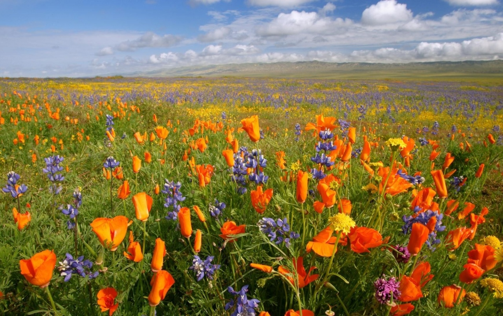
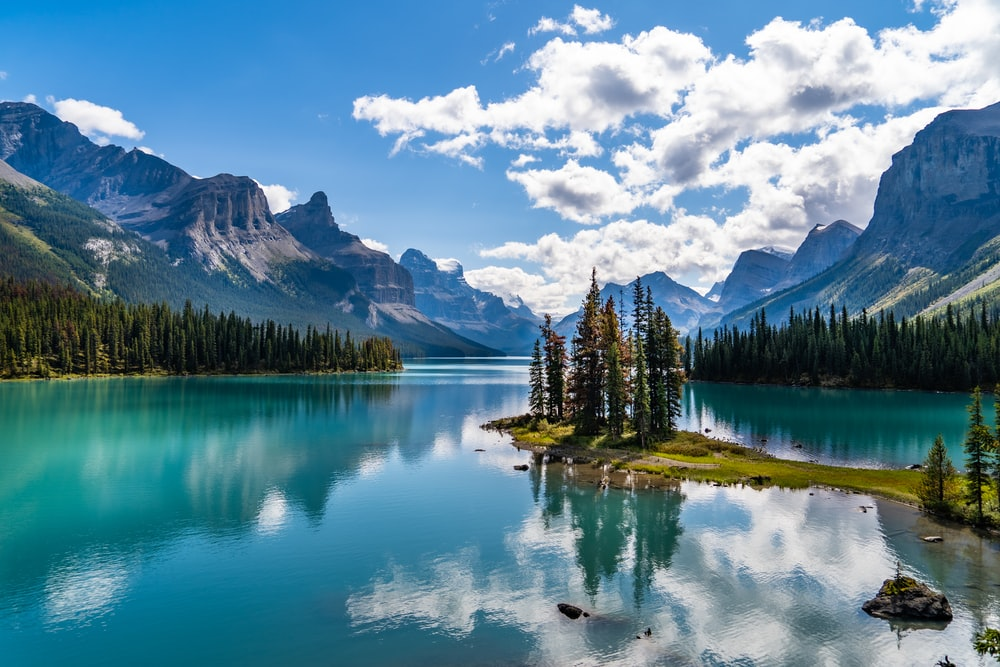

<!DOCTYPE html>
<html lang="en" dir="ltr">
  <head>
    <meta charset="utf-8">
    <title></title>
  </head>
  <body style="background-color:PowderBlue">
    <h1 style="text-align:center">Beautiful Nature Scene</h1>
     
The Ocean: wander along the sea shore and watch the sunset

     
     
     
Flower Meadow: surround by beautiful flowers and enjoy the bright sunlight

     
     
Moutains and Lakes: Sit nearby the lake and enjoy the peacefulness

     
  </body>
</html>

